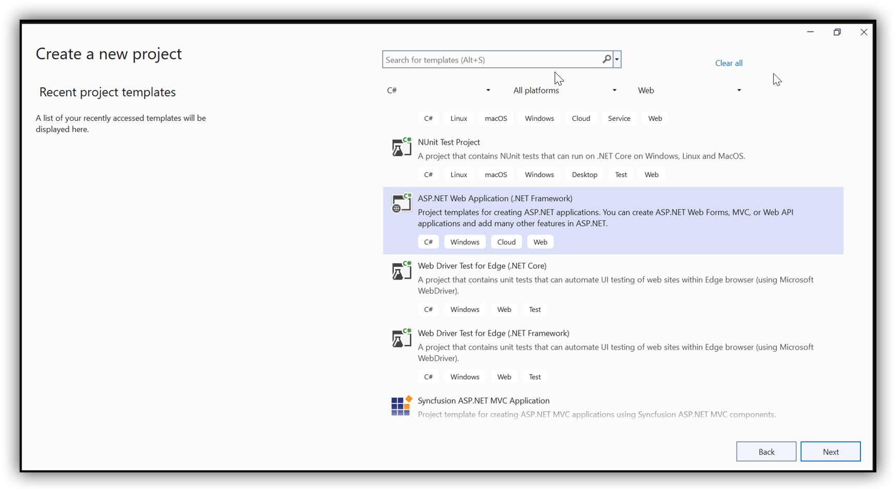
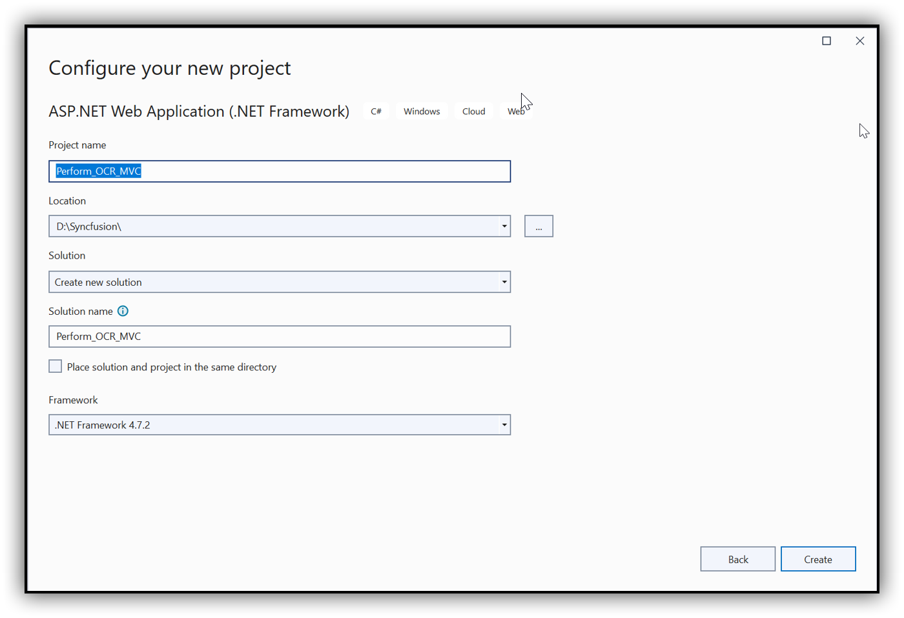
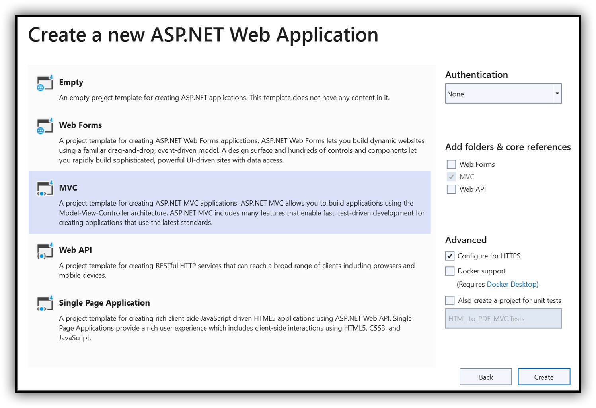
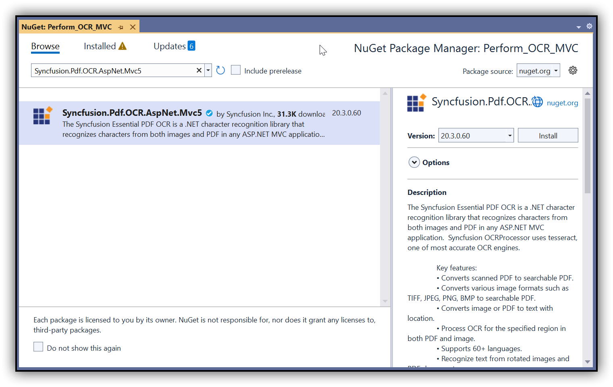

##### Example: ASP.NET MVC

# Perform OCR in ASP.NET MVC using C#

The [Syncfusion&reg; .NET OCR library](https://www.syncfusion.com/document-processing/pdf-framework/net/pdf-library/ocr-process) is used to extract text from scanned PDFs and images in ASP.NET MVC application with the help of Google's [Tesseract](https://github.com/tesseract-ocr/tesseract) Optical Character Recognition engine.  

## Steps to perform OCR on entire PDF document in ASP.NET MVC

Step 1: Create a new C# ASP.NET Web Application (.NET Framework) project.


Step 2: In the project configuration windows, name your project and click Create.



Step 3: Install the [Syncfusion.Pdf.OCR.AspNet.Mvc5](https://www.nuget.org/packages/Syncfusion.Pdf.OCR.AspNet.Mvc5) NuGet package as a reference to your .NET applications from [NuGet.org](https://www.nuget.org/).


Step 4: Tesseract assemblies are not added as a reference. They must be kept in the local machine, and the assemblies location is passed as a parameter to the OCR processor.

```csharp
OCRProcessor processor = new OCRProcessor(@"TesseractBinaries/");
```

Step 5: Place the Tesseract language data {e.g, eng.traineddata} in the local system and provide a path to the OCR processor. Please use the OCR language data for other languages using the following link.

[Tesseract language data](https://github.com/tesseract-ocr/tessdata)

```csharp
OCRProcessor processor = new OCRProcessor(@"TesseractBinaries/");
processor.PerformOCR(lDoc,@"TessData/");
```

Step 6: Include the following namespaces in the [HomeController.cs](Perform_OCR_MVC/Controllers/HomeController.cs) file.

```csharp
using Syncfusion.OCRProcessor;
using Syncfusion.Pdf.Parsing;
```   

Step 7: Add a new button in the [Index.cshtml](Perform_OCR_MVC/Views/Home/Index.cshtml) as follows.

```csharp
@{Html.BeginForm("PerformOCR", "Home", FormMethod.Post);
   {
      <div>
         <input type="submit" value="Perform OCR" style="width:150px;height:27px" />
      </div>
   }
   Html.EndForm();
}
```

Step 8: Add a new action method named PerformOCR in the [HomeController.cs](Perform_OCR_MVC/Controllers/HomeController.cs) file and use the following code sample to perform OCR in the ASP.NET MVC application.

```csharp
//Initialize the OCR processor by providing the path of tesseract binaries(SyncfusionTesseract.dll and liblept168.dll).
using (OCRProcessor processor = new OCRProcessor("TesseractBinaries/3.05/x86/"))
{
   FileStream fileStream = new FileStream("Input.pdf", FileMode.Open, FileAccess.Read);
   //Load a PDF document.
   PdfLoadedDocument lDoc = new PdfLoadedDocument(fileStream);
   //Set OCR language to process.
   processor.Settings.Language = Languages.English;
   processor.Settings.TesseractVersion = TesseractVersion.Version3_05;
   //Process OCR by providing the PDF document and Tesseract data.
   processor.PerformOCR(lDoc, "Tessdata/");
   //Open the document in browser after saving it.
   lDoc.Save("Output.pdf", HttpContext.ApplicationInstance.Response, Syncfusion.Pdf.HttpReadType.Save);
   //Close the document.
   lDoc.Close(true);
   return View();
}
```

By executing the program, you will get a PDF document as follows.

