##### Example: Azure

# Perform OCR in Azure App Service using C#

The [Syncfusion .NET OCR library](https://www.syncfusion.com/document-processing/pdf-framework/net/pdf-library/ocr-process) is used to extract text from scanned PDFs and images in Azure with the help of Google's [Tesseract](https://github.com/tesseract-ocr/tesseract) Optical Character Recognition engine.  

## Steps to perform OCR on entire PDF document in Azure App Service on Windows

Step 1: Create a new ASP.NET Core MVC application.
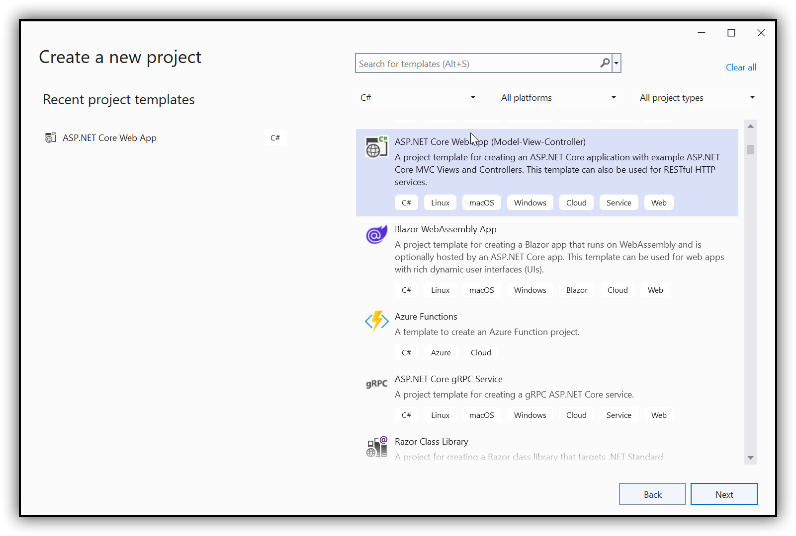 

Step 2: In configuration windows, name your project and click Next.
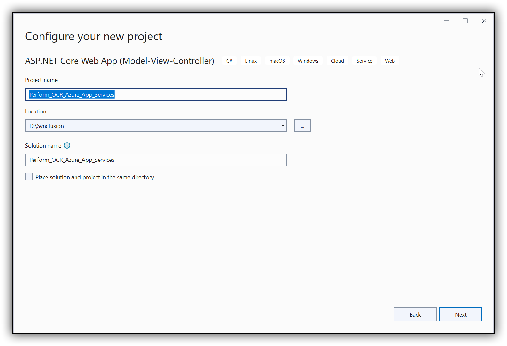 
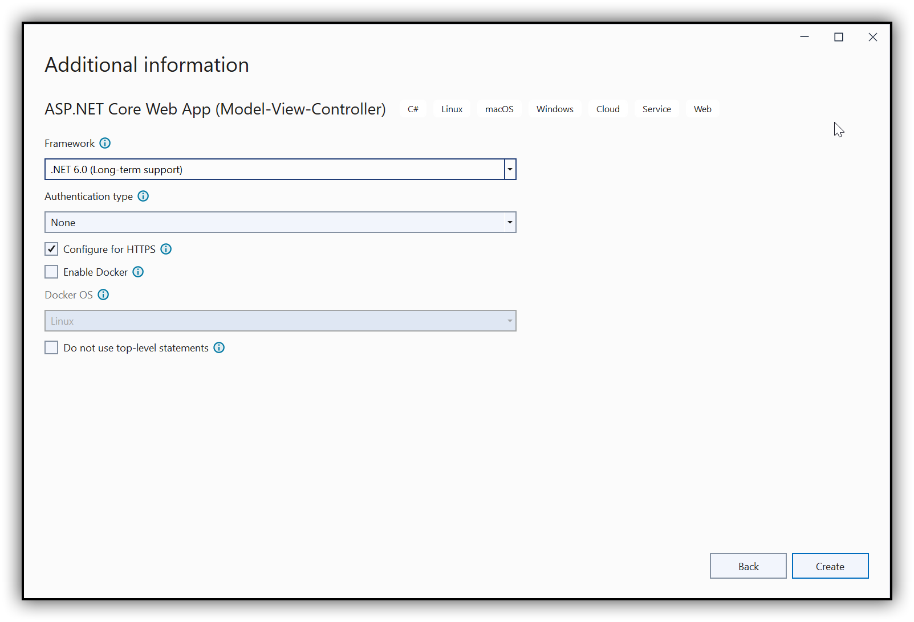

Step 3: Install the [Syncfusion.PDF.OCR.NET](https://www.nuget.org/packages/Syncfusion.PDF.OCR.NET) NuGet package as a reference to your .NET Core application [NuGet.org](https://www.nuget.org/).
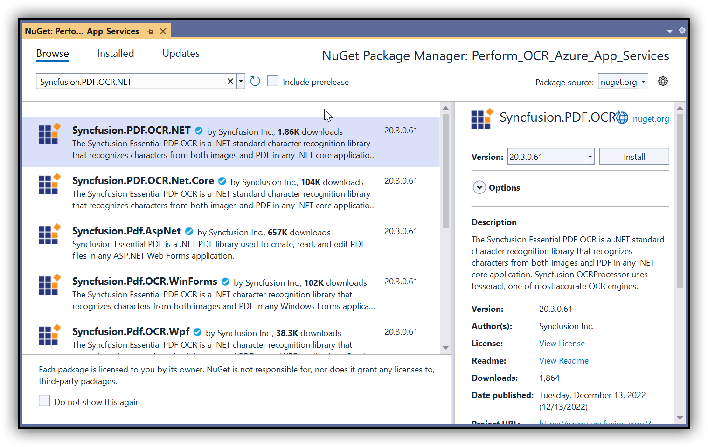

Step 4: Tesseract assemblies are not added as a reference. They must be kept in the local machine, and the assemblies location is passed as a parameter to the OCR processor.

```csharp
OCRProcessor processor = new OCRProcessor(@"Tesseractbinaries/Windows");
```

Step 5: Place the Tesseract language data {e.g, eng.traineddata} in the local system and provide a path to the OCR processor. Please use the OCR language data for other languages using the following link.

[Tesseract language data](https://github.com/tesseract-ocr/tessdata)

```csharp
OCRProcessor processor = new OCRProcessor(@"Tesseractbinaries/Windows");
processor.PerformOCR(lDoc, "tessdata/");
```

Step 6: Add a new button in [Index.cshtml](Perform_OCR_Azure_App_Services/Views/Home/Index.cshtml) as follows.

```csharp
@{
   Html.BeginForm("PerformOCR", "Home", FormMethod.Get);
   {
      <br />
      <div>
         <input type="submit" value="Perform OCR" style="width:150px;height:27px" />
      </div>
   }
   Html.EndForm();
}
```

Step 7: Include the following namespaces in the [HomeController.cs](Perform_OCR_Azure_App_Services/Controllers/HomeController.cs) file.

```csharp
using Syncfusion.OCRProcessor;
using Syncfusion.Pdf.Parsing;
using Microsoft.AspNetCore.Hosting.IHostingEnvironment;
```   

Step 8: Add a new action method named PerformOCR in the [HomeController.cs](Perform_OCR_Azure_App_Services/Controllers/HomeController.cs) file and use the following code sample to perform OCR in the ASP.NET MVC application.

```csharp
//To get content root path of the project.
private readonly IHostingEnvironment _hostingEnvironment;
public HomeController(IHostingEnvironment hostingEnvironment)
{
   _hostingEnvironment = hostingEnvironment;
}
public IActionResult PerformOCR()
{
   //Initialize the OCR processor with tesseract binaries folder path.
   OCRProcessor processor = new OCRProcessor("Tesseractbinaries/Windows/");
   //Load a PDF document.
   FileStream stream1 = new FileStream("Input.pdf", FileMode.Open);
   PdfLoadedDocument lDoc = new PdfLoadedDocument(stream1);
   //Set OCR language to process.
   processor.Settings.Language = Languages.English;
   //Perform OCR with input document and tessdata (Language packs).
   string ocr = processor.PerformOCR(lDoc, "Tessdata/");
   //Save the document. 
   MemoryStream stream = new MemoryStream();
   lDoc.Save(stream);
   return File(stream.ToArray(), System.Net.Mime.MediaTypeNames.Application.Pdf, "OCR_Azure.pdf");
}   
```

Step 9: Now, check the OCR creation in the local machine.

### Steps to publish as Azure App Service

Step 1: Right-click the project and click Publish.
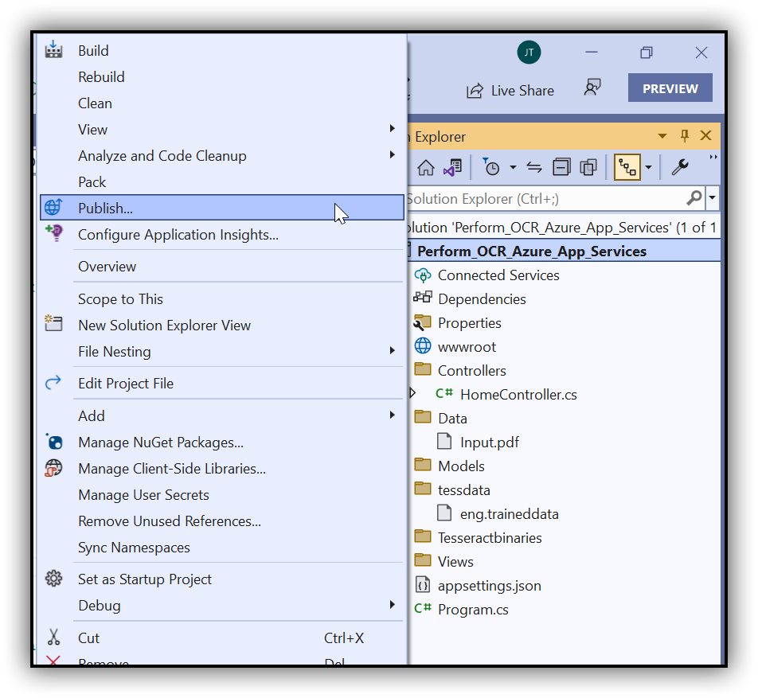

Step 2: Create a new profile in the publish target window.
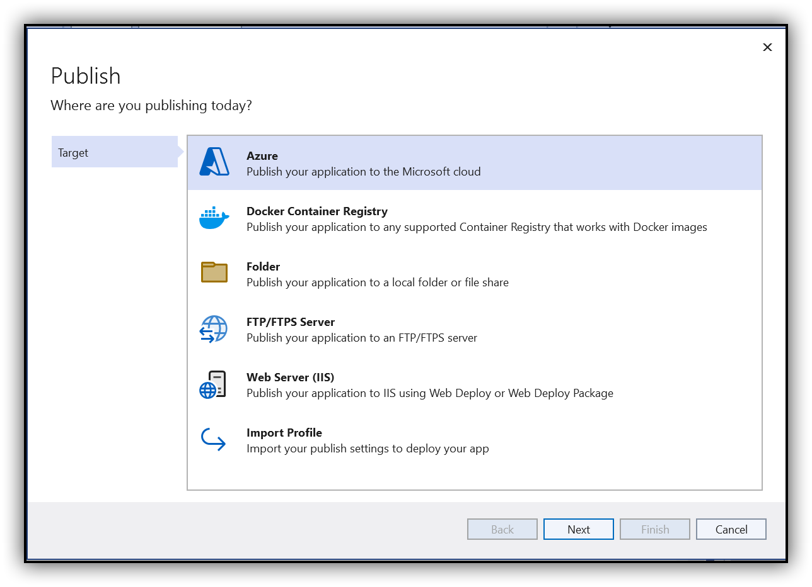
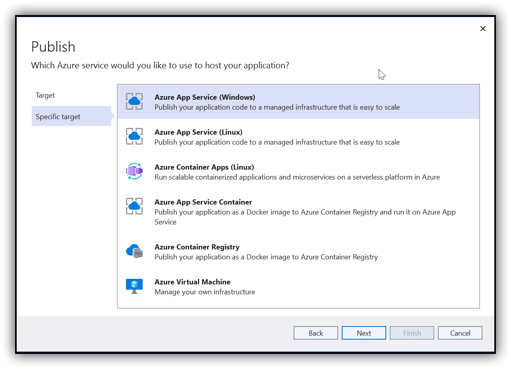 

Step 3: Create an App service using an Azure subscription and select a hosting plan.
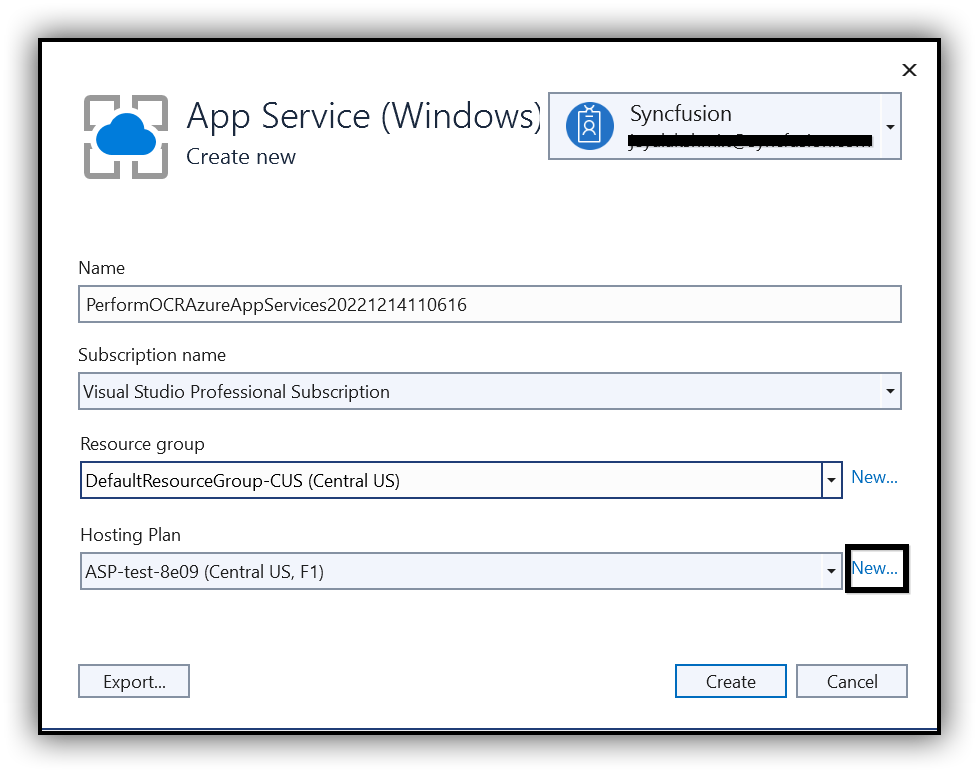 

Step 4: Configure the Hosting plan.
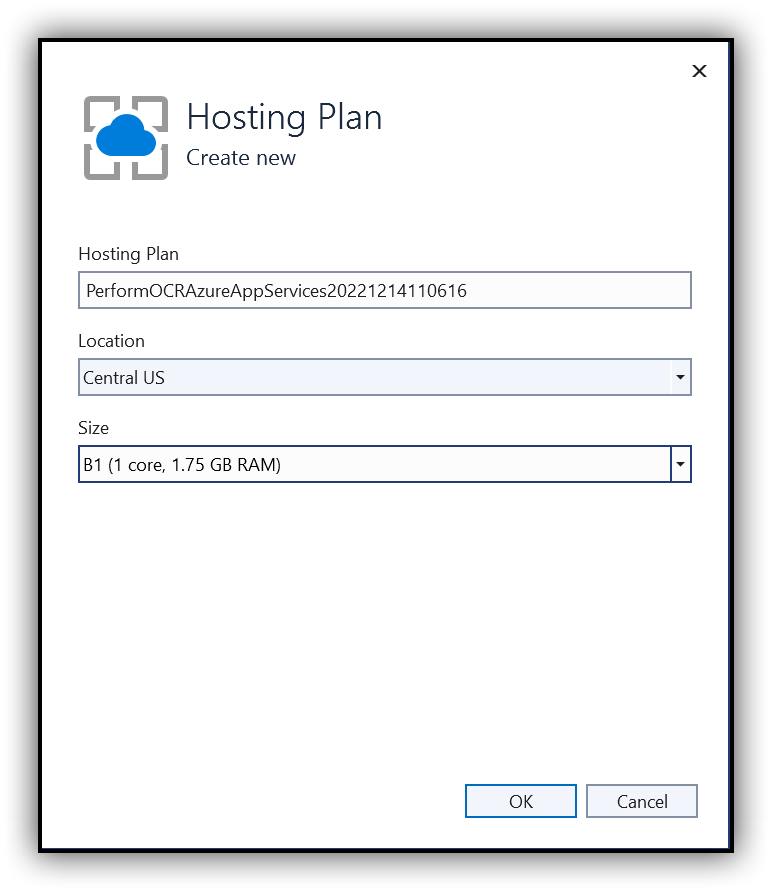

Step 5: After creating a profile, click Publish.
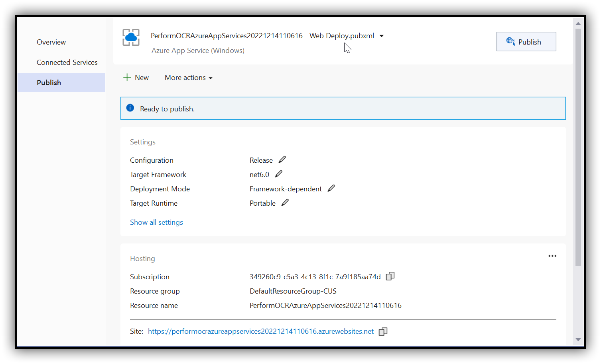 

Now, the published webpage will open in the browser. Perform OCR for a PDF document.
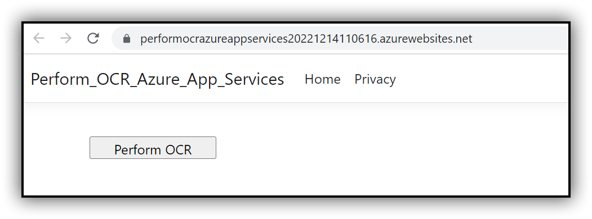
 