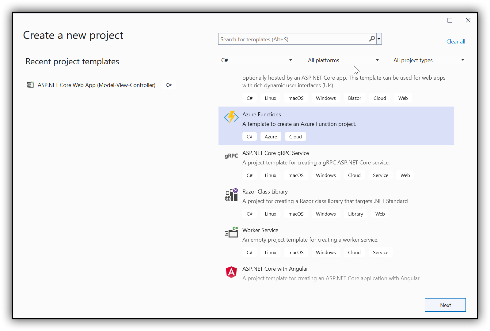
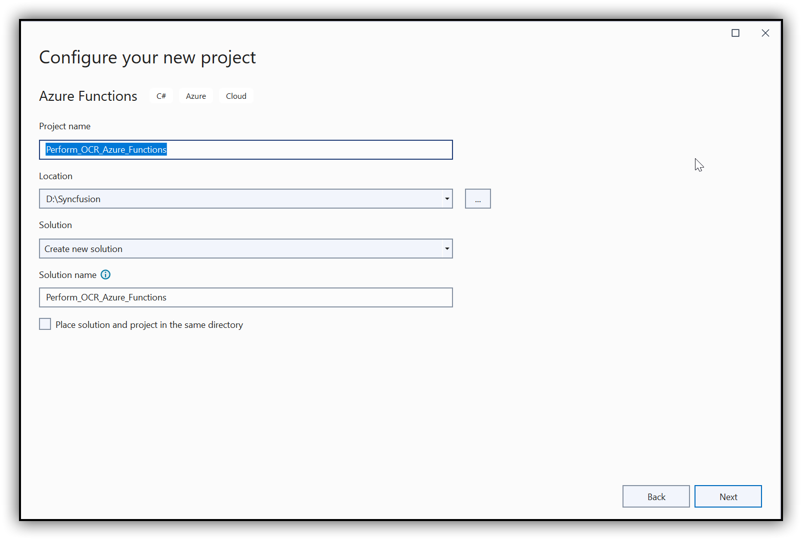
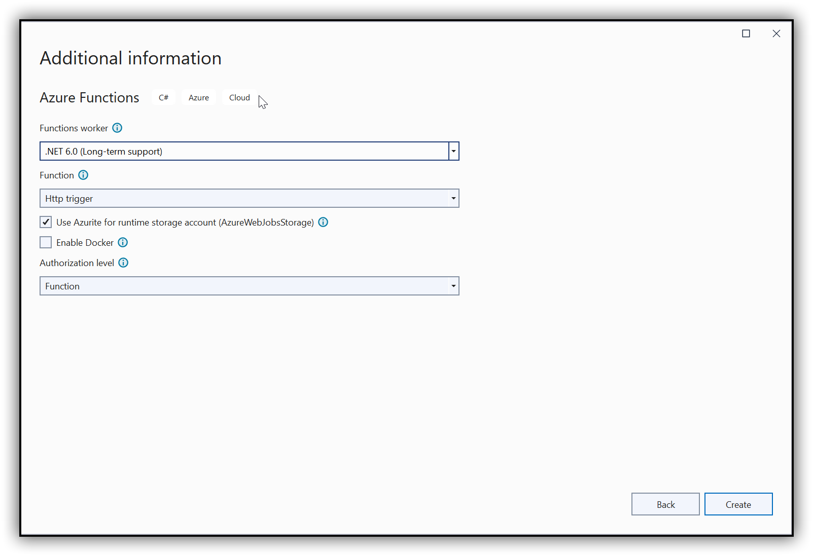
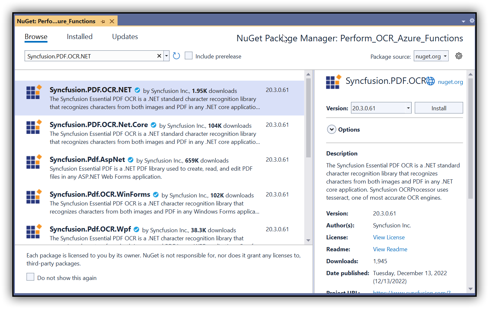
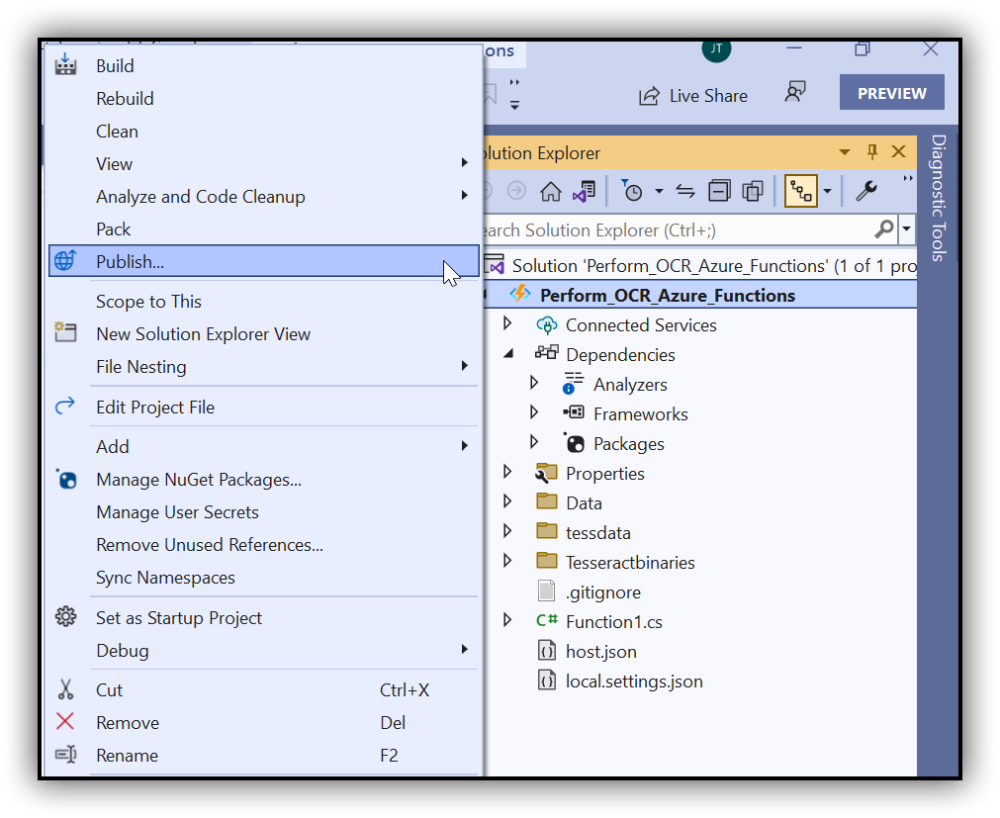
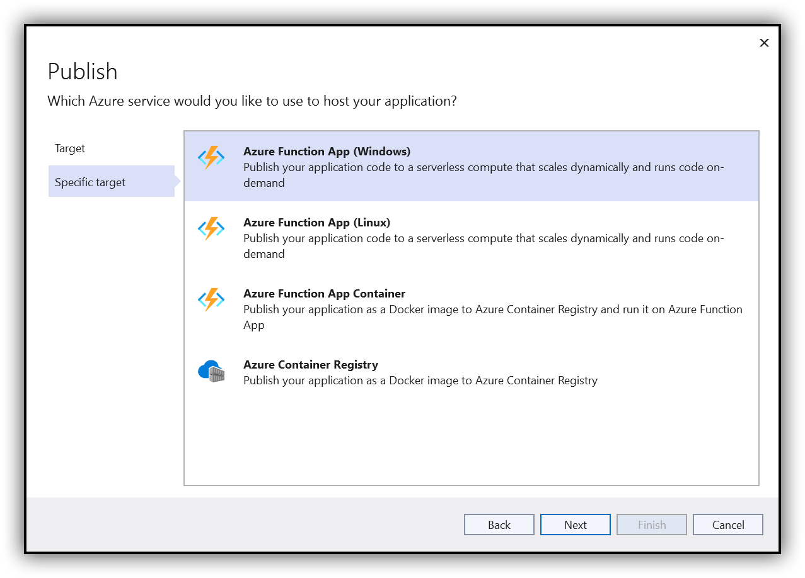
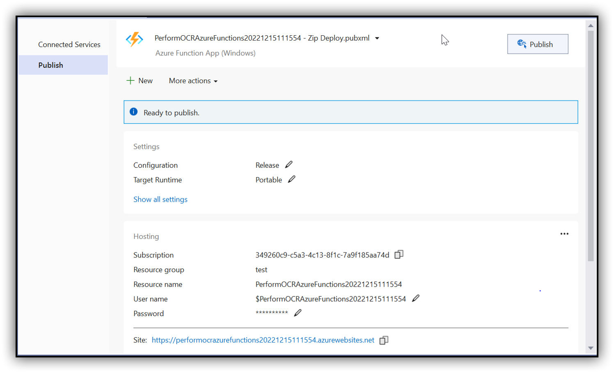

##### Example: Azure

# Perform OCR in Azure Functions using C#

The [Syncfusion .NET OCR library](https://www.syncfusion.com/document-processing/pdf-framework/net/pdf-library/ocr-process) is used to extract text from scanned PDFs and images in Azure with the help of Google's [Tesseract](https://github.com/tesseract-ocr/tesseract) Optical Character Recognition engine.  

## Steps to perform OCR on the entire PDF document in Azure Functions

Step 1: Create the Azure function project.
 

Step 2: Select the framework to Azure Functions and select HTTP triggers as follows.
 


Step 3: Install the [Syncfusion.PDF.OCR.NET](https://www.nuget.org/packages/Syncfusion.PDF.OCR.NET) NuGet package as a reference to your .NET Core application [NuGet.org](https://www.nuget.org/).


Step 4: Tesseract assemblies are not added as a reference. They must be kept in the local machine, and the assemblies location is passed as a parameter to the OCR processor.

```csharp
OCRProcessor processor = new OCRProcessor(@"Tesseractbinaries/Windows");
```

Step 5: Place the Tesseract language data {E.g, eng.traineddata} in the local system and provide a path to the OCR processor. Please use the OCR language data for other languages using the following link.

[Tesseract language data](https://github.com/tesseract-ocr/tessdata)

```csharp
OCRProcessor processor = new OCRProcessor(@"Tesseractbinaries/Windows");
processor.PerformOCR(lDoc, "tessdata/");
```

Step 6: Include the following namespaces in the [Function1.cs](Perform_OCR_Azure_Functions/Function1.cs) file to perform OCR for a PDF document using C#.

```csharp
using System;
using System.IO;
using System.Threading.Tasks;
using Syncfusion.OCRProcessor;
using Syncfusion.Pdf.Graphics;
using Syncfusion.Pdf;
using System.Net.Http;
using Syncfusion.Pdf.Parsing;
using System.Net.Http.Headers;
using System.Net;
using Microsoft.Azure.WebJobs.Host;
using Microsoft.Azure.WebJobs;
using Microsoft.Azure.WebJobs.Extensions.Http;
```

Step 7: Add the following code sample in the Function1 class to perform OCR for a PDF document in Azure Functions.

```csharp
[FunctionName("Function1")]
public static async Task<HttpResponseMessage> Run([HttpTrigger(AuthorizationLevel.Function, "get", "post", Route = null)] HttpRequestMessage req, TraceWriter log, ExecutionContext executionContext)
{
   MemoryStream ms = new MemoryStream();
   try
   {
      string path = Path.GetFullPath(Path.Combine(executionContext.FunctionAppDirectory, "bin\\Tesseractbinaries\\Windows"));
      OCRProcessor processor = new OCRProcessor(path);
      FileStream stream = new FileStream(Path.Combine(executionContext.FunctionAppDirectory, "Data", "Input.pdf"), FileMode.Open);
      //Load a PDF document.
      PdfLoadedDocument lDoc = new PdfLoadedDocument(stream);
      //Set OCR language to process.
      processor.Settings.Language = Languages.English;
      //Perform OCR with input document and tessdata (Language packs).
      string ocr = processor.PerformOCR(lDoc, Path.Combine(executionContext.FunctionAppDirectory, "tessdata"));            
      //Save the PDF document.  
      lDoc.Save(ms);
      ms.Position = 0;
   }
   catch (Exception ex)
   {
      //Add a page to the document.
      PdfDocument document = new PdfDocument();
      PdfPage page = document.Pages.Add();
      //Create PDF graphics for the page.
      PdfGraphics graphics = page.Graphics;
      //Set the standard font.
      PdfFont font = new PdfStandardFont(PdfFontFamily.Helvetica, 6);
      //Draw the text.
      graphics.DrawString(ex.ToString(), font, PdfBrushes.Black, new Syncfusion.Drawing.PointF(0, 0));
      ms = new MemoryStream();
      //Save the PDF document.  
      document.Save(ms);
   }
   HttpResponseMessage response = new HttpResponseMessage(HttpStatusCode.OK);
   response.Content = new ByteArrayContent(ms.ToArray());
   response.Content.Headers.ContentDisposition = new ContentDispositionHeaderValue("attachment")
   {
      FileName = "Output.pdf"
   };
   response.Content.Headers.ContentType = new System.Net.Http.Headers.MediaTypeHeaderValue("application/pdf");
   return response;
}
```

Step 8: Now, check the OCR creation in the local machine.

### Steps to publish as Azure Functions 

Step 1: Right-click the project and click Publish. Then, create a new profile in the Publish Window. So, create the Azure Function App with a consumption plan.




Step 2: After creating the profile, click Publish.


Step 3: Now, go to the Azure portal and select the Functions Apps. After running the service, click Get function URL > Copy. Include the URL as a query string in the URL. Then, paste it into the new browser tab. You will get a PDF document as follows.
 
