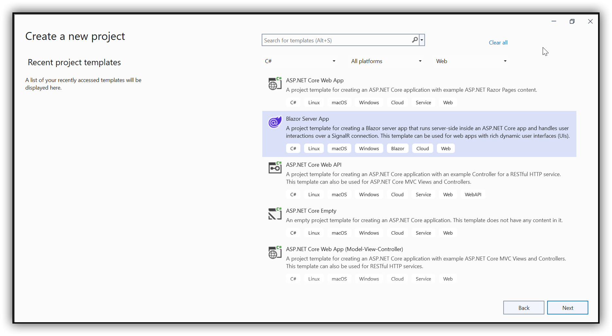
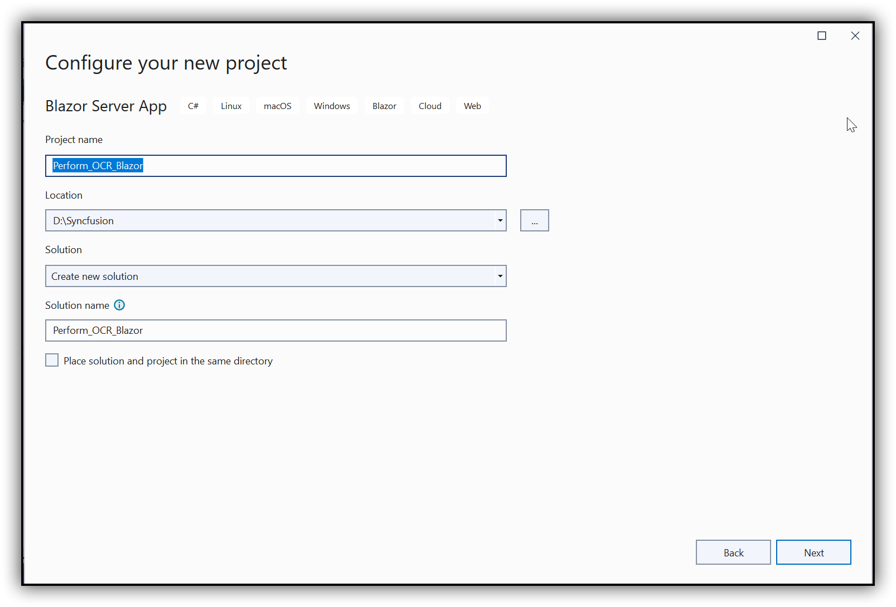
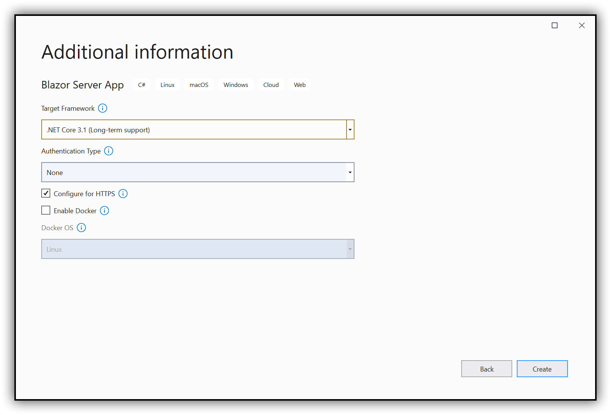
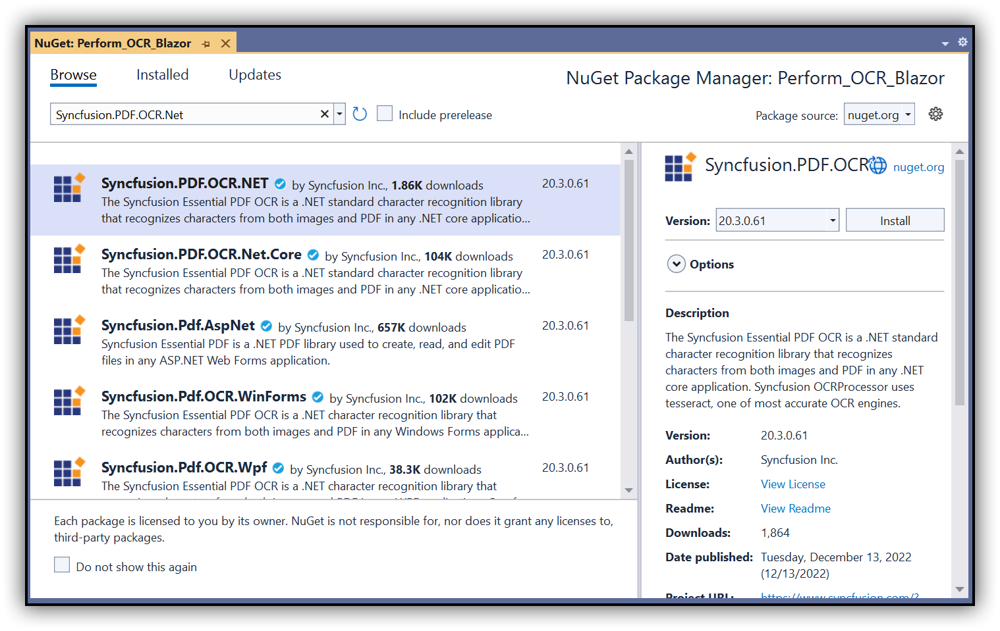

##### Example: Blazor

# Perform OCR in Blazor using C#

The [Syncfusion .NET OCR library](https://www.syncfusion.com/document-processing/pdf-framework/net/pdf-library/ocr-process) is used to extract text from scanned PDFs and images in the Blazor application with the help of Google's [Tesseract](https://github.com/tesseract-ocr/tesseract) Optical Character Recognition engine.

## Steps to perform OCR on the entire PDF document in the Blazor application

Step 1: Create a new C# Blazor Server application project. Select Blazor App from the template and click Next.


Step 2: In the project configuration window, name your project and click Create.

  

Step 3: Install the [Syncfusion.PDF.OCR.NET](https://www.nuget.org/packages/Syncfusion.PDF.OCR.NET) NuGet package as a reference to your Blazor Server application from [NuGet.org](https://www.nuget.org/).


Step 4: Tesseract assemblies are not added as a reference. They must be kept in the local machine, and the assemblies location is passed as a parameter to the OCR processor.
   
```csharp
OCRProcessor processor = new OCRProcessor(@"Tesseractbinaries/Windows");
```

Step 5: Place the Tesseract language data {e.g, eng.traineddata} in the local system and provide a path to the OCR processor. Please use the OCR language data for other languages using the following link.

[Tesseract language data](https://github.com/tesseract-ocr/tessdata)

```csharp
OCRProcessor processor = new OCRProcessor(@"Tesseractbinaries/Windows");
processor.PerformOCR(lDoc, "tessdata/");
```

Step 6: Create a new class file named ExportService under the Data folder and include the following namespaces in the file.

```csharp
using Syncfusion.OCRProcessor;
using Syncfusion.Pdf.Parsing;
using System.IO;
```

Step 7: Use the following code sample to perform OCR in the [ExportService](Perform_OCR_Blazor/Data/ExportService.cs) class.

```csharp
public MemoryStream CreatePdf()
{            
   //Initialize the OCR processor by providing the path of tesseract binaries(SyncfusionTesseract.dll and liblept168.dll).
   using (OCRProcessor processor = new OCRProcessor("Tesseractbinaries/Windows/"))
   {
      FileStream fileStream = new FileStream("Input.pdf", FileMode.Open, FileAccess.Read);
      //Load a PDF document.
      PdfLoadedDocument lDoc = new PdfLoadedDocument(fileStream);
      //Set OCR language to process.
      processor.Settings.Language = Languages.English;
      //Process OCR by providing the PDF document and Tesseract data.
      processor.PerformOCR(lDoc, "Tessdata/");
      //Create memory stream.
      MemoryStream stream = new MemoryStream();
      //Save the document to memory stream.
      lDoc.Save(stream);
      return stream;
   }
}
```

Step 8: Register your service in the ConfigureServices method available in the Startup.cs class as follows.

```csharp
public void ConfigureServices(IServiceCollection services)
{
   services.AddRazorPages();
   services.AddServerSideBlazor();
   services.AddSingleton<WeatherForecastService>();
   services.AddSingleton<ExportService>();
}
```

Step 9: Inject the ExportService into FetchData.razor using the following code.

```csharp
@inject ExportService exportService
@inject Microsoft.JSInterop.IJSRuntime JS
@using  System.IO;
```

Step 10: Create a button in the FetchData.razor using the following code.

```csharp
<button class="btn btn-primary" @onclick="@PerformOCR">Perform OCR</button>
```

Step 11: Add the PerformOCR method in FetchData.razor page to call the export service.

```csharp
@functions
{ 
   protected async Task PerformOCR()
   {
      ExportService exportService = new ExportService();
      using (MemoryStream excelStream = exportService.CreatePdf())
      {
         await JS.SaveAs("Output.pdf", excelStream.ToArray());
      }
   }
}
```

Step 12: Create a class file with the FileUtil name and add the following code to invoke the JavaScript action to download the file in the browser.

```csharp
public static class FileUtil
{
   public static ValueTask<object> SaveAs(this IJSRuntime js, string filename, byte[] data)
      => js.InvokeAsync<object>(
           "saveAsFile",
           filename,
           Convert.ToBase64String(data));
}
```

Step 13: Add the following JavaScript function in the _Host.cshtml available under the Pages folder.

```csharp
<script type="text/javascript">
   function saveAsFile(filename, bytesBase64) {
      if (navigator.msSaveBlob) {
            //Download document in Edge browser.
            var data = window.atob(bytesBase64);
            var bytes = new Uint8Array(data.length);
            for (var i = 0; i < data.length; i++) {
                  bytes[i] = data.charCodeAt(i);
               }
               var blob = new Blob([bytes.buffer], { type: "application/octet-stream" });
               navigator.msSaveBlob(blob, filename);
            }
            else {
               var link = document.createElement('a');
               link.download = filename;
               link.href = "data:application/octet-stream;base64," + bytesBase64;
               document.body.appendChild(link); // Needed for Firefox
               link.click();
               document.body.removeChild(link);
            }
         }
</script>
```

You will get the following output in the browser by executing the program.


Click the button and get a PDF document with the following output.
