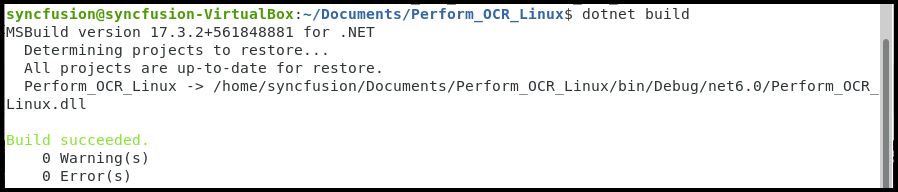

# Perform OCR in Linux

The [Syncfusion .NET OCR library](https://www.syncfusion.com/document-processing/pdf-framework/net/pdf-library/ocr-process) is used to extract text from scanned PDFs and images in the Linux application with the help of Google's [Tesseract](https://github.com/tesseract-ocr/tesseract) Optical Character Recognition engine.
## Pre-requisites

The following Linux dependencies should be installed where the conversion takes place. 

```csharp

sudo apt-get update
sudo apt-get install libgdiplus
sudo apt-get install y- libopenjp2-7

```


## Steps to convert HTML to PDF in .NET Core application on Linux.

Step 1: Execute the following command in the Linux terminal to create a new .NET Core Console application.

```csharp

dotnet new console

```

 

Step 2: Install the [Syncfusion.PDF.OCR.Net](https://www.nuget.org/packages/Syncfusion.PDF.OCR.Net/) NuGet package as a reference to your .NET Core application [NuGet.org](https://www.nuget.org/).

```csharp

dotnet add package Syncfusion.PDF.OCR.Net -v xx.x.x.xx -s https://www.nuget.org/

```


Step 3: Tesseract assemblies are not added as a reference. They must be kept in the local machine, and the location of the assemblies is passed as a parameter to the OCR processor.

```csharp

OCRProcessor processor = new OCRProcessor(@"TesseractBinaries/")

```

Step 4: Place the Tesseract language data {E.g eng.traineddata} in the local system and provide a path to the OCR processor. Please use the OCR language data for other languages using the following link.

 [Tesseract language data](https://github.com/tesseract-ocr/tessdata)

```csharp

OCRProcessor processor = new OCRProcessor("Tesseractbinaries/");
processor.PerformOCR(loadedDocument, "tessdata/");

```

Step 5: Include the following namespaces in [Program.cs](Perform_OCR_Linux/Program.cs) file.

```csharp

using Syncfusion.OCRProcessor;
using Syncfusion.Pdf;
using Syncfusion.Pdf.Parsing;

```

Step 6:  Add code sample to perform OCR on entire PDF document in [Program.cs](Perform_OCR_Linux/Program.cs) file

```csharp
 
string path = ("Tesseractbinaries/Linux/");
string docPath = ("input.pdf");

//Initialize the OCR processor
using (OCRProcessor processor = new OCRProcessor(path))
{
    //Load the PDF document 
    FileStream stream = new FileStream(docPath, FileMode.Open, FileAccess.Read);
    PdfLoadedDocument lDoc = new PdfLoadedDocument(stream);

    //Language to process the OCR
    processor.Settings.Language = Languages.English;
    //Process OCR by providing loaded PDF document, Data dictionary and language
    processor.PerformOCR(lDoc, ("tessdata/"));

    //Save the OCR processed PDF document in the disk
    MemoryStream streamData = new MemoryStream();
    lDoc.Save(streamData);
    File.WriteAllBytes("Output.pdf", streamData.ToArray());
    lDoc.Close(true);

}

```

Step 7: Execute the following command to restore the NuGet packages.

```csharp

dotnet restore

```


Step 8:  Execute the following command in the terminal to build the application.

```csharp

dotnet build

```



Step 9: Execute the following command in the terminal to run the application.

```csharp

dotnet run

```


By executing the program, you will get the PDF document as follows. The output will be saved in parallel to the program.cs file.

