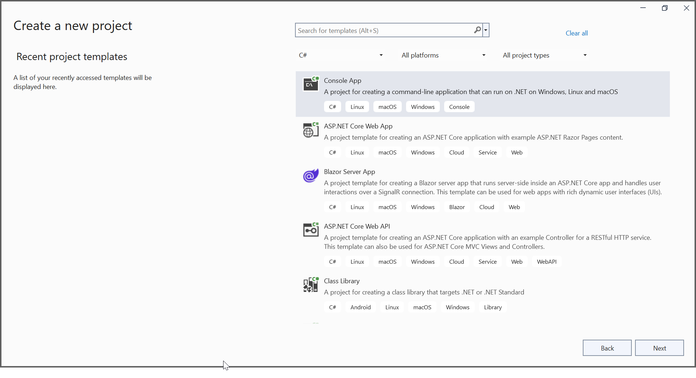
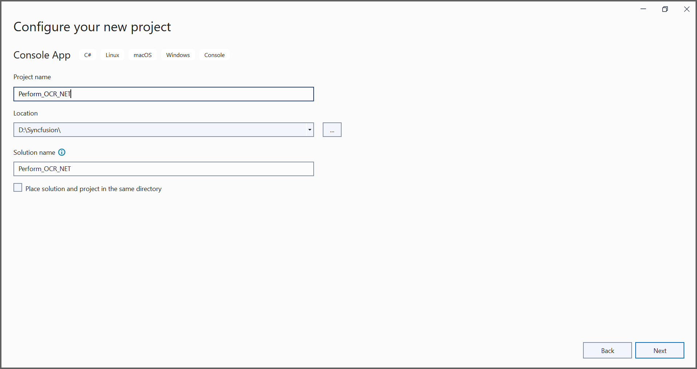
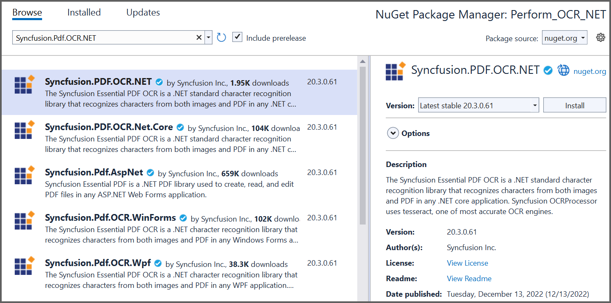

##### Example: .NET 

# Perform OCR in .NET  
The [Syncfusion .NET OCR library](https://www.syncfusion.com/document-processing/pdf-framework/net/pdf-library/ocr-process) used to extract text from scanned PDFs and images in .NET application with the help of Google's [Tesseract](https://github.com/tesseract-ocr/tesseract) Optical Character Recognition engine.

## Steps to perform OCR on an entire PDF document in a .NET application 

Step 1: Create a new .NET console application. 


In project configuration window, name your project and select Next.


Step 2: Install [Syncfusion.PDF.OCR.NET](https://www.nuget.org/packages/Syncfusion.PDF.OCR.NET) NuGet package as a reference to your .NET application from [nuget.org](https://www.nuget.org).


Step 3: Tesseract assemblies are not added as a reference. They must be kept in the local machine, and the location of the assemblies is passed as a parameter to the OCR processor.

```csharp

OCRProcessor processor = new OCRProcessor(@"TesseractBinaries/")

```

Step 4: Place the Tesseract language data {E.g eng.traineddata} in the local system and provide a path to the OCR processor. Please use the OCR language data for other languages using the following link.

[Tesseract language data](https://github.com/tesseract-ocr/tessdata)

```csharp

OCRProcessor processor = new OCRProcessor("Tesseractbinaries/");
processor.PerformOCR(loadedDocument, "tessdata/");

```

Step 5: Include the following namespace in your class file. 

```csharp

using Syncfusion.OCRProcessor;
using Syncfusion.Pdf.Parsing;

```

Step 6: Use the following code sample to perform OCR on the entire PDF document in the [Program.cs](Perform_OCR_NET/Program.cs). 

```csharp

//Initialize the OCR processor by providing the path of tesseract binaries.
using (OCRProcessor processor = new OCRProcessor("TesseractBinaries/Windows/"))
{
    //Load an existing PDF document.
    FileStream stream = new FileStream("Input.pdf", FileMode.Open, FileAccess.Read);
    PdfLoadedDocument pdfLoadedDocument = new PdfLoadedDocument(stream);

    //Set OCR language to process.
    processor.Settings.Language = Languages.English;

    //Process OCR by providing the PDF document and Tesseract data.
    processor.PerformOCR(pdfLoadedDocument, "TessData/");

    //Create file stream.
    using (FileStream outputFileStream = new FileStream(@"Output.pdf", FileMode.Create, FileAccess.ReadWrite))
    {
        //Save the PDF document to file stream.
        pdfLoadedDocument.Save(outputFileStream);
    }

    //Close the document.
    pdfLoadedDocument.Close(true);
}

```

By executing the program, you will get a PDF document as follows.


