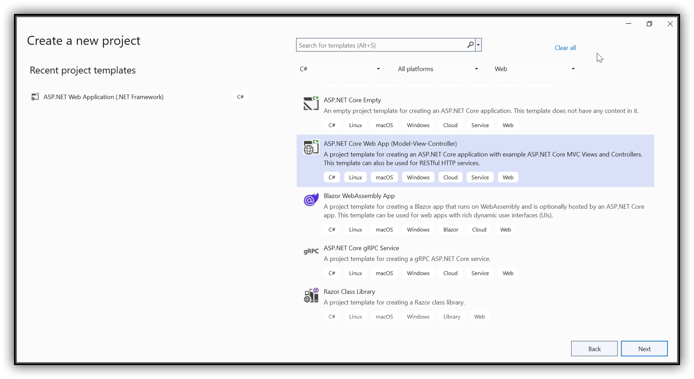
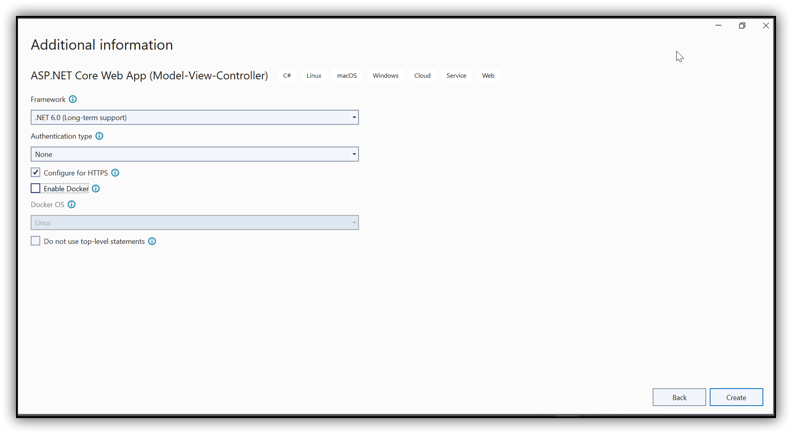
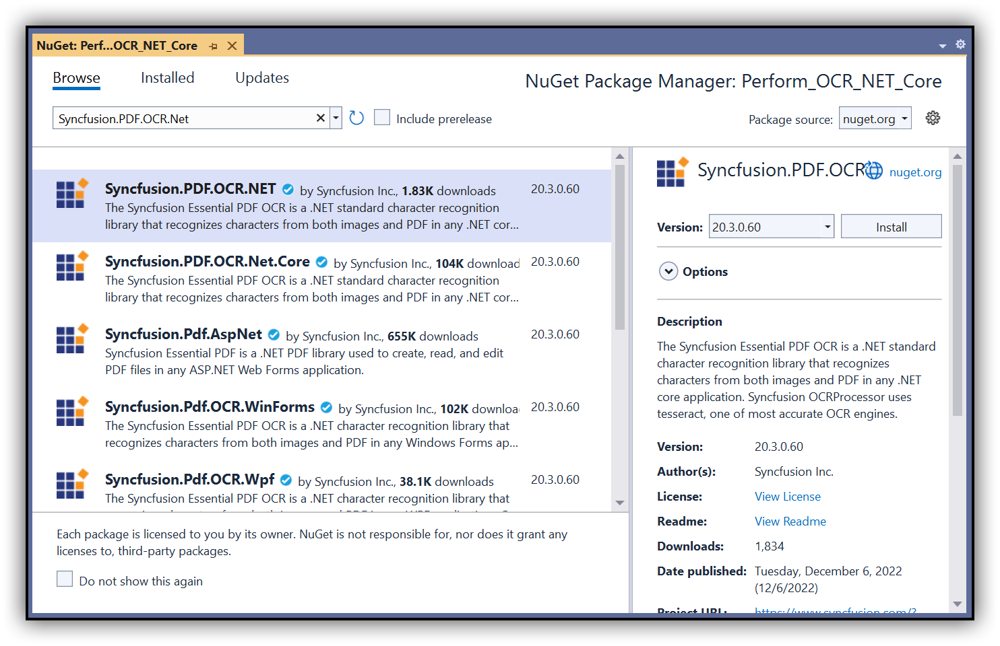

##### Example: ASP.NET Core

# Perform OCR in ASP.NET Core using C#

The [Syncfusion .NET OCR library](https://www.syncfusion.com/document-processing/pdf-framework/net/pdf-library/ocr-process) is used to extract text from the scanned PDFs and images in the ASP.NET Core application with the help of Google's [Tesseract](https://github.com/tesseract-ocr/tesseract) Optical Character Recognition engine.  

## Steps to perform OCR on entire PDF document in ASP.NET Core application

Step 1: Create a new C# ASP.NET Core Web Application project.


Step 2: In configuration windows, name your project and click Next.



Step 3: Install the [Syncfusion.PDF.OCR.NET](https://www.nuget.org/packages/Syncfusion.PDF.OCR.NET) NuGet package as a reference to your .NET Standard applications from [NuGet.org](https://www.nuget.org/).   


Step 4: Tesseract assemblies are not added as a reference. They must be kept in the local machine, and the assemblies location is passed as a parameter to the OCR processor.

```csharp
OCRProcessor processor = new OCRProcessor(@"Tesseractbinaries/Windows");
```

Step 5: Place the Tesseract language data {E.g, eng.traineddata} in the local system and provide a path to the OCR processor. Please use the OCR language data for other languages using the following link.

[Tesseract language data](https://github.com/tesseract-ocr/tessdata)

```csharp
OCRProcessor processor = new OCRProcessor(@"Tesseractbinaries/Windows");
processor.PerformOCR(lDoc, "tessdata/");
```

Step 6: A default controller with the name [HomeController.cs](Perform_OCR_NET_Core/Controllers/HomeController.cs) gets added to the creation of the ASP.NET Core MVC project. Include the following namespaces in that HomeController.cs file.

```csharp
using Syncfusion.OCRProcessor;
using Syncfusion.Pdf.Parsing;
```

Step 7: Add a new button in the [index.cshtml](Perform_OCR_NET_Core/Views/Home/Index.cshtml) as follows.

```csharp
@{Html.BeginForm("PerformOCR", "Home", FormMethod.Post);
   {
      <div>
         <input type="submit" value="Perform OCR" style="width:150px;height:27px" />
      </div>
   }
   Html.EndForm();
}
```

Step 8: Add a new action method named PerformOCR in the [HomeController.cs](Perform_OCR_NET_Core/Controllers/HomeController.cs) and use the following code sample to perform OCR in the ASP.NET Core application.

```csharp
//Initialize the OCR processor by providing the path of tesseract binaries(SyncfusionTesseract.dll and liblept168.dll).
using (OCRProcessor processor = new OCRProcessor("Tesseractbinaries/Windows/"))
{
   FileStream fileStream = new FileStream("Input.pdf", FileMode.Open, FileAccess.Read);
   //Load a PDF document.
   PdfLoadedDocument lDoc = new PdfLoadedDocument(fileStream);
   //Set OCR language to process.
   processor.Settings.Language = Languages.English;
   //Process OCR by providing the PDF document and Tesseract data.
   processor.PerformOCR(lDoc,"tessdata/");
   //Create memory stream.
   MemoryStream stream = new MemoryStream();
   //Save the document to memory stream.
   lDoc.Save(stream);
   lDoc.Close();
   //Set the position as '0'
   stream.Position = 0;
   //Download the PDF document in the browser.
   FileStreamResult fileStreamResult = new FileStreamResult(stream, "application/pdf");
   fileStreamResult.FileDownloadName = "Sample.pdf";
   return fileStreamResult;
}
```

By executing the program, you will get a PDF document as follows.

