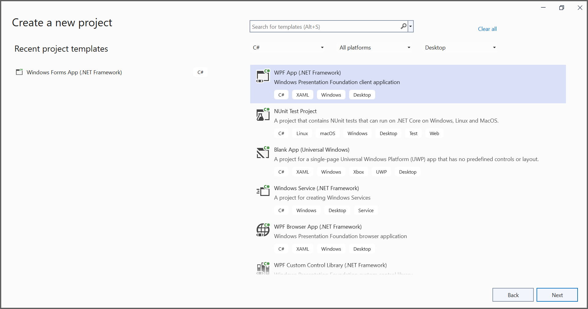
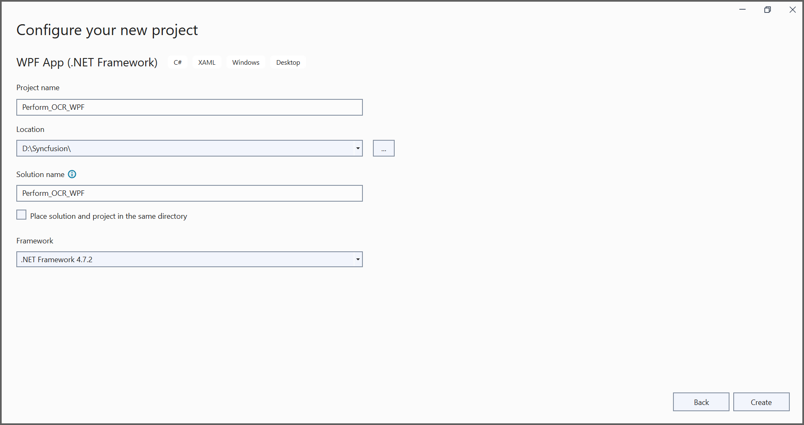
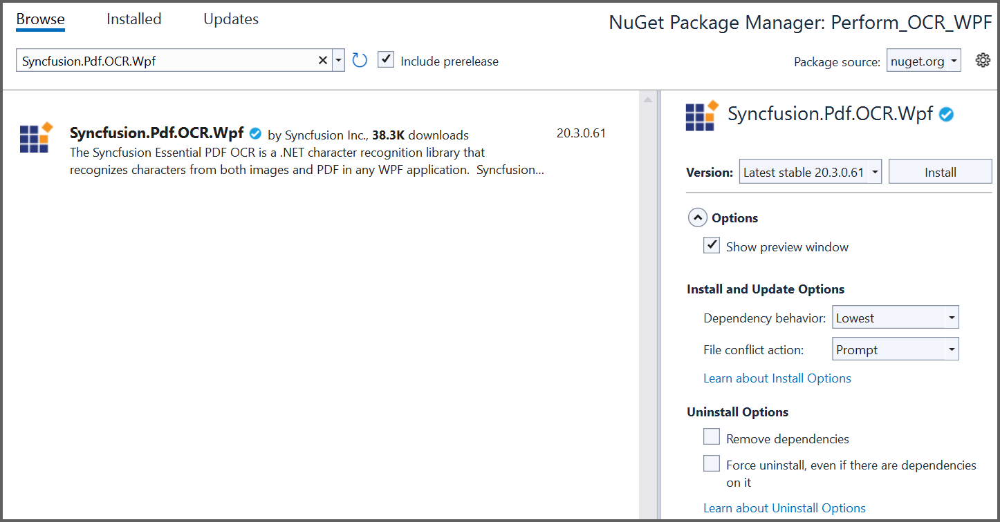

##### Example: WPF

# Perform OCR on WPF 

The [Syncfusion&reg; .NET OCR library](https://www.syncfusion.com/document-processing/pdf-framework/net/pdf-library/ocr-process) used to extract text from scanned PDFs and images in WPF application with the help of Google's [Tesseract](https://github.com/tesseract-ocr/tesseract) Optical Character Recognition engine.

## Steps to perform OCR on entire PDF document in WPF

Step 1: Create a new WPF application project. 


In project configuration window, name your project and select Create. 


Step 2: Install the [Syncfusion.Pdf.OCR.Wpf](https://www.nuget.org/packages/Syncfusion.Pdf.OCR.Wpf) NuGet package as a reference to your WPF application from [nuget.org](https://www.nuget.org/).


Step 3: Add a new button in [MainWindow.xaml](Perform_OCR_WPF/MainWindow.xaml) to perform OCR as follows.

```csharp

<Grid>
    <Button Content="Perform OCR" HorizontalAlignment="Left" Margin="279,178,0,0" VerticalAlignment="Top" Height="68" Width="203" Click="Button_Click"/>
</Grid>

```

Step 4: Include the following namespaces in the [MainWindow.xaml.cs](Perform_OCR_WPF/MainWindow.xaml.cs) file.

```csharp

using Syncfusion.OCRProcessor;
using Syncfusion.Pdf.Parsing;

```

Step 5: Tesseract assemblies are not added as a reference. They must be kept in the local machine, and the location of the assemblies is passed as a parameter to the OCR processor.

```csharp

OCRProcessor processor = new OCRProcessor(@"TesseractBinaries/")

```

Step 6: Place the Tesseract language data {E.g eng.traineddata} in the local system and provide a path to the OCR processor. Please use the OCR language data for other languages using the following link.

[Tesseract language data](https://github.com/tesseract-ocr/tessdata)

```csharp

OCRProcessor processor = new OCRProcessor("Tesseractbinaries/");
processor.PerformOCR(loadedDocument, "tessdata/");

```

Step 6: Add the following code in Button_Click to perform OCR on the entire PDF document. 

```csharp

//Initialize the OCR processor by providing the path of tesseract binaries(SyncfusionTesseract.dll and liblept168.dll).
using (OCRProcessor processor = new OCRProcessor(@"TesseractBinaries/"))
{
    //Load an existing PDF document.
    PdfLoadedDocument loadedDocument = new PdfLoadedDocument("Input.pdf");

    //Set the tesseract version.
    processor.Settings.TesseractVersion = TesseractVersion.Version4_0;

    //Set OCR language to process.
    processor.Settings.Language = Languages.English;

    //Process OCR by providing the PDF document and Tesseract data.
    processor.PerformOCR(loadedDocument, @"Tessdata/");

    //Save the OCR processed PDF document in the disk.
    loadedDocument.Save("OCR.pdf");
    loadedDocument.Close(true);
}
//This will open the PDF file so, the result will be seen in default PDF viewer.
Process.Start("OCR.pdf");

```

By executing the program, you will get the PDF document as follows. 
